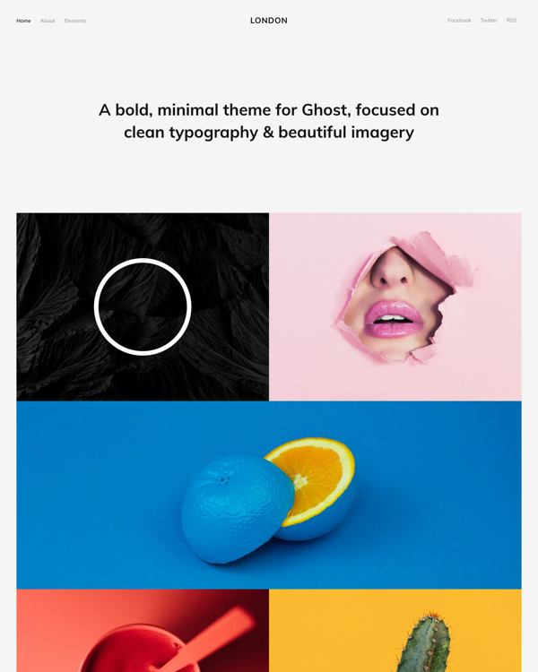

<!-- AUTO-GENERATED-CONTENT:START (STARTER) -->

  

<h1 align="center">
  London by <a href="https://jamstack.studio">Jamstack Studio</a>

</h1>

---

A custom, image-centric theme for Gatsby. Made for publishers and portfolios with plenty of graphics to show off to the world. Completely free and fully responsive, released under the MIT license.

**Based on [London](https://github.com/TryGhost/London) for Ghost**

**Demo: https://gatsby-london.netlify.com**

---

  

---

_I haven't really spent any time adding the JS animations or removing any unused CSS (automatically done by PurgeCSS). You will also need HTML in your Markdown file in order to add CSS classes to your images_

---

_First time with Gatsby? Take a look on the [official and community-created starters](https://www.gatsbyjs.org/docs/gatsby-starters/)._

<!-- AUTO-GENERATED-CONTENT:END -->
